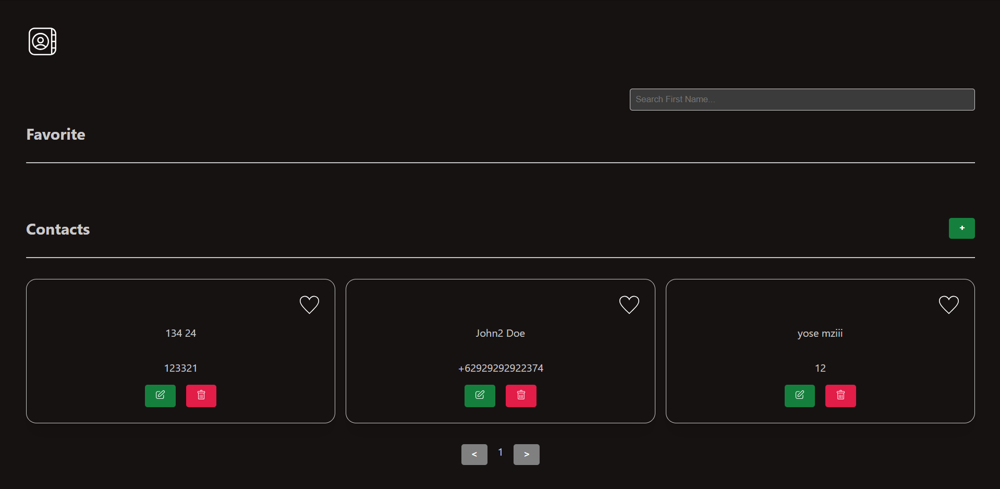

# React + TypeScript + Vite - Phone Book Project

A project where users can easily view, search, add to favorites, create, edit, and delete contacts.

[](http://localhost:5173/)

> **Warning**
> This project is still in development and is not ready for production use.

## Tech Stack

- [React](https://react.dev/)
- [Typescript](https://www.typescriptlang.org/)
- [Vite](https://vitejs.dev/)
- [React Router](https://reactrouter.com/en/main)
- [Apollo GraphQl (React)](https://www.apollographql.com/docs/react)
- [emotionCSS](https://emotion.sh/docs/introduction)

This template provides a minimal setup to get React working in Vite with HMR and some ESLint rules.

Currently, two official plugins are available:

- [@vitejs/plugin-react](https://github.com/vitejs/vite-plugin-react/blob/main/packages/plugin-react/README.md) uses [Babel](https://babeljs.io/) for Fast Refresh
- [@vitejs/plugin-react-swc](https://github.com/vitejs/vite-plugin-react-swc) uses [SWC](https://swc.rs/) for Fast Refresh

## Installation

```bash
pnpm install

# run project (local)
pnpm run dev
```

```bash
# first installation note
pnpm create vite
✔ Project name: … vite-phone-book
✔ Select a framework: › React
✔ Select a variant: › TypeScript

Done. Now run:

  cd vite-phone-book
  pnpm install
  pnpm run dev

pnpm add react-router-dom
pnpm add @apollo/client graphql
pnpm add @emotion/react @emotion/styled
```

## Environment Variable Setup

Create `.env.local` for local development

```env
VITE_GQL_ENDPOINT=https://some-url.com/graphql
```

## Expanding the ESLint configuration

If you are developing a production application, we recommend updating the configuration to enable type aware lint rules:

- Configure the top-level `parserOptions` property like this:

```js
   parserOptions: {
    ecmaVersion: 'latest',
    sourceType: 'module',
    project: ['./tsconfig.json', './tsconfig.node.json'],
    tsconfigRootDir: __dirname,
   },
```

- Replace `plugin:@typescript-eslint/recommended` to `plugin:@typescript-eslint/recommended-type-checked` or `plugin:@typescript-eslint/strict-type-checked`
- Optionally add `plugin:@typescript-eslint/stylistic-type-checked`
- Install [eslint-plugin-react](https://github.com/jsx-eslint/eslint-plugin-react) and add `plugin:react/recommended` & `plugin:react/jsx-runtime` to the `extends` list
